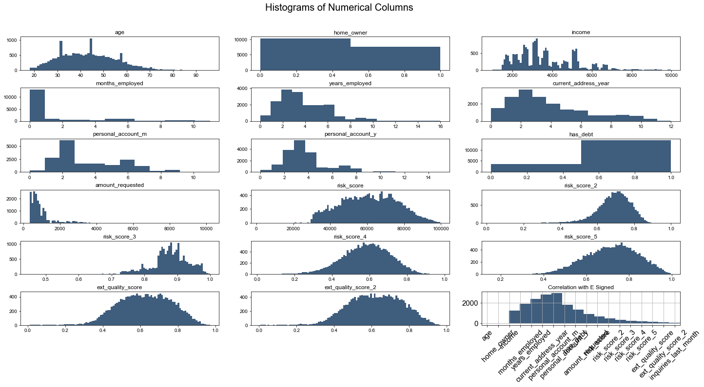
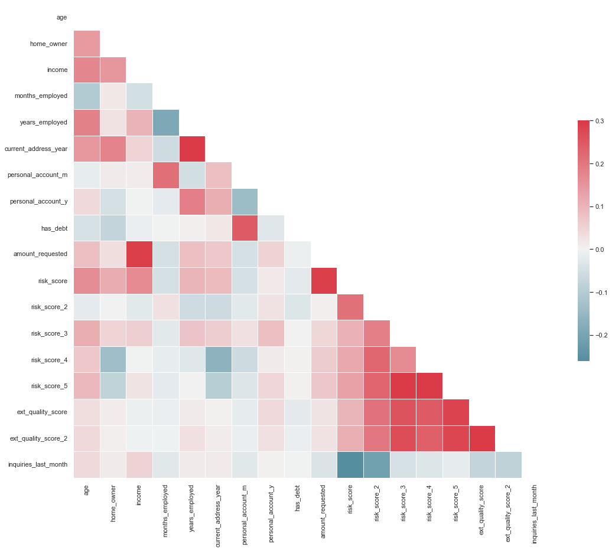

# Predicting the Likelihood of E-Signing a Loan Based on Financial History

# Machine Learning:

- The data for these projects are manufactured fields based on trends found in real-world case studies. The fields describe what companies usually track from their users, and the distributions are based on observed distributions in the real-world analysis. This means that, although the data has been artificially created, the patterns, associations, and distributions are not random.

- The data serves as a good representation of what you may encounter in the workplace. That is, the data is rarely clean, and a lot of pre-processing is needed to get it ready for modeling.
***

## Note on models Building:
The Model Building Process is composed of multiple parts:
- **Plotting with Matplotlib and Seaborn** -  Exploratory Data Analysis (EDA)
- **Data Manipulation** - Used Pandas and Numpy for all of our data formatting steps.
- **Classification Models** from Sklearn Library (Logistic Regression, Tree, SVM, ...)
- **K-Fold Cross Validation, Grid Search** (Parameter Tuning), and **Feature Selection** algorithms.
***

# 1. INTRODUCTION

Lending companies work by analyzing the financial history of their loan applicants and choosing whether or not the applicant is too risky to be given a loan. If the applicant is not, the company then determines the terms of the loan. To acquire these applicants, companies can organically receive them through their websites/ apps, often with the help of advertisement companies. Other times, lending companies partner with peer-to-peer (P2P) lending marketplaces, in order to acquire leads of possible applicants. Some examples of the marketplace include Upstart, Lending Tree, and Lending Club. In this project, we are going to asses the 'quality' of the leads our company receives from these marketplaces.

- **Market:** The target audience is the set of loan applicants who reached out through an intermediary marketplace.
- **Product:** A loan.
- **Goal:** Develop a model to predict for 'quality' applicants are those who reach a key part of the loan application process.

# 2. BUSINESS CHALLENGE

- In this Case Study, we will be working for a fin-tech company that specializes in loans. It offers low APR loans to applicants based on their financial habits, as almost all lending companies do. This company has partnered with a P2P lending marketplace that provides real-time leads (loan applicants). The numbers of conversations from these leads are satisfactory.
- The company tasks you with creating a model that predicts whether or not these leads will complete the electronic signature phase of the loan applicant (a.k.a. e_signed). The company seeks to leverage this model to identify less 'qualify' applicants (e.g. those who are not responding to the onboarding process) and experiment with giving them different onboarding screens.
- The reason for selecting the e_signing process as the response variable is due to the structure of the loan application.
- The official application begins with the lead arriving on our website after we opted to acquire it. Here, The applicant begins the onboarding process to apply for a loan. The user begins to provide more financial information by going over every screen of the onboarding process. This first phase ends with the applicant providing his/ her signature indicating all of the given information is correct.
- Any of the following screens, in which the applicant is approved/denied and given the terms of the loan, is dependent on the company, not the applicant stops having control of the application process.
- 
# CORRELATION VISUALIZATION AND CONFUSION MATRIX

# CONCLUSION
Our model has given us an accuracy of around 64%. With this, we have an algorithm that can help predict whether or not a user will complete the E-signing step of the loan application. One way to leverage this model is to target those predicted to not reach the e-sign phase with customized onboarding. This means that when a lead arrives from the marketplace, they may receive a different onboarding experience based on how likely they are to finish the general onboarding process. This can help our company minimize how many people drop off from the funnel. This funnel of screens is as effective as we, as a company, built it. Therefore, user drop-off in this funnel falls entirely on our shoulders. So, with new onboarding screens built intentionally to lead users to finalize the loan application, we can attempt to get more than 40% of those predicted to not finish the process to complete the e-sign step. If we can do this, then we can drastically increase profits. As a result, if we can increase the number of loan takers, we are increasing profits. All with a simple model.

